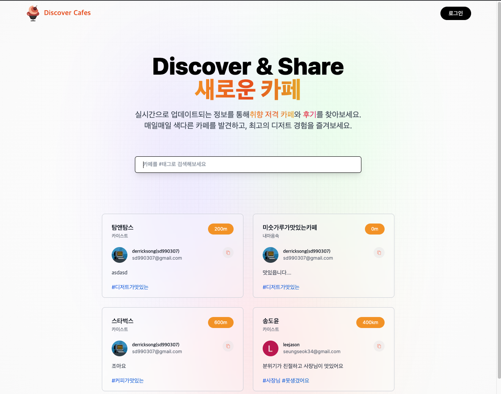
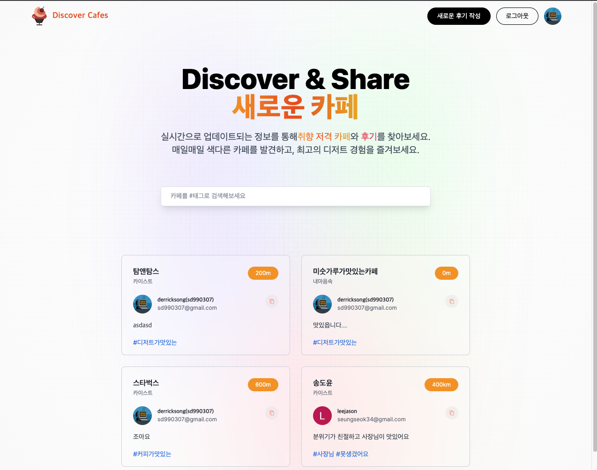
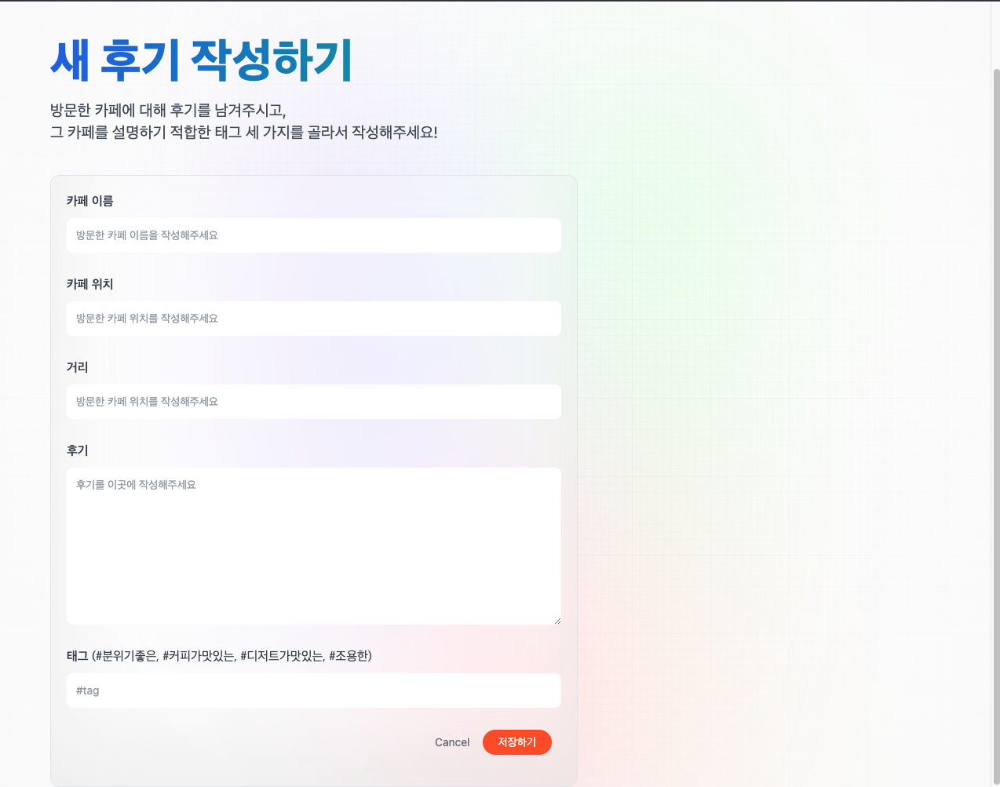
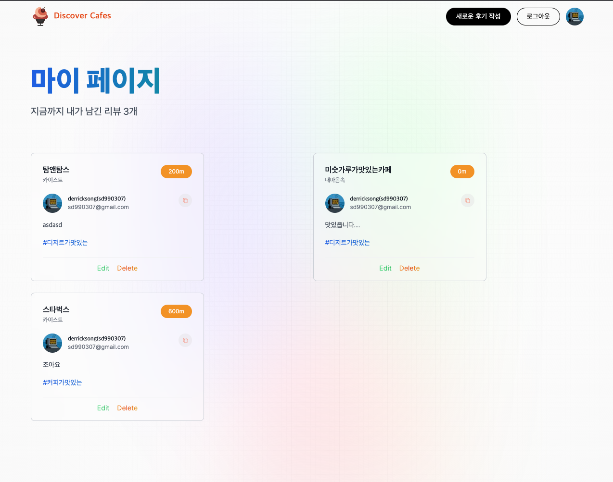
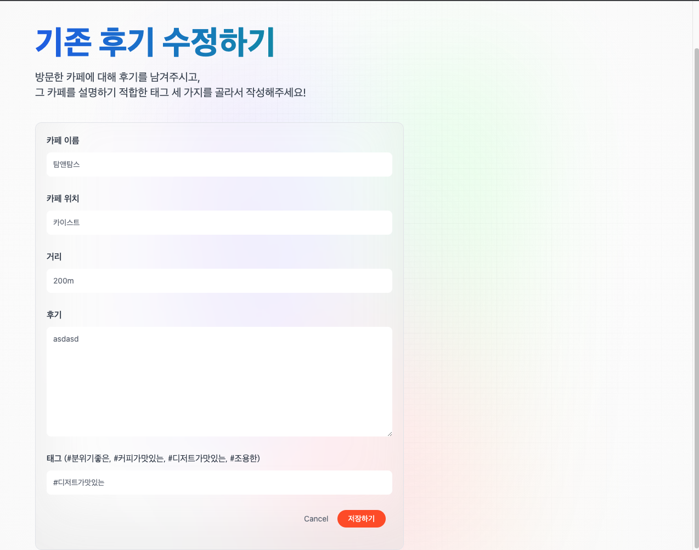

# :bulb: Discover Cafes! 
새로운 카페를 찾고 공유하는 웹 애플리케이션
 
  

>**Discover Cafes!**,  

> 실시간으로 업데이트 되는 정보를 통해 취향 저격 카페와 후기를 찾아보세요  
> 매일 매일 색다른 카페를 발견하고, 최고의 디저트 경험을 즐겨보세요!   

 

## 💻 Next.js, MongoDB, Google SDK, Vercel을 활용한 소셜 웹 애플리케이션  

- [x] Next.js를 활용한 풀스택 웹 애플리케이션 구현
- [x] Google SDK와 next-auth를 이용하여, OAuth2.0 서비스 구축
- [x] Next.js 기반 백엔드 서버를 구축하여, 소셜 애플리케이션 서비스를 제공하기 위한 CRUD 서비스 구축
- [x] React.js를 활용한 프론트엔드 디자인

Visit our project here
[Discover Cafes!](https://cafe-finder-eight.vercel.app/)

## 🙆 Members
|Name|Education|github ID|
|:---|:---|:---|
|송도윤|GIST 전기전자컴퓨터공학부|[SongDerrick](https://github.com/SongDerrick/)|
|윤동규|KAIST 전산학부|[justinyoonwk](https://github.com/justinyoonwk)|

please vist my blog haha 😄 -> [도윤송의 블로그](https://doyoonsong.vercel.app)
 

---

## 📖 Table of Contents

- [Project Description](#project-description)
- [Features](#features)
  
## Project Description

Vercel의 서버리스 람다 함수를 이용하여 배포한 Next.js 기반 CRUD 소셜 웹 애플리케이션입니다.  
카페를 다녀온 후에 후기를 남길 수 있는데, 어디 카페에 갔는지, 간단한 후기, 그리고 카페를 잘 나타내는 태그를 기록할 수 있습니다. 
다른 사람들이 남긴 후기를 볼 수 있고, 자기가 남긴 후기는 삭제 및 수정이 가능합니다. 

### Main Page             

메인 페이지 입니다.  
상단 왼쪽의 로고를 클릭하면 메인 페이지로 갈 수 있고, 오른쪽 상단의 로그인 버튼을 클릭하면 Google 계정으로 로그인 할 수 있습니다. 

이 때 세션을 이용해서 로그인 버튼을 렌더링할지 로그아웃버튼을 렌더링할지 클라이언트 사이드에서 판단하는 로직으로 구현했습니다.  
만약 브라우저 내에 세션 유저 아이디와 내부 DB와의 정보가 일치하지 않거나, 세션 유저 아이디가 애초에 존재하지 않는다면 로그인 버튼이 뜹니다  

로그인 후 페이지는 다음과 같이 바뀝니다.  
오른쪽 상단에 버튼이 두 개 생기게 되는데, 새로운 후기를 작성하는 버튼과 로그아웃 버튼입니다.  

중간 부분에는 우리 서비스에 대한 간략한 설명이 나와있고, 그 아래 input에 태그를 검색하여 태그가 걸린 카페를 따로 찾을 수 있습니다.  
아래 부분에는 피드가 뜨게 되는데, 피드 컴포넌트 내부에 카드 리스트 컴포넌트를 렌더링 했고,  
카드 리스트 컴포넌트 내부에 각각의 정보를 담은 카드를 반복문으로 추가하는 식으로 프론트엔드를 구성했습니다.  

각각의 카드에는 카페의 이름, 카페의 위치, 지금의 나로부터 거리(현재로는 더미 데이터입니다), 이 후기를 남긴 사용자, 후기 내용과 태그가 렌더링됩니다  
카드 오른편에는 복사 버튼이 있는데, 이 버튼을 누르면 후기 내용이 복사가 되는 구조입니다. 리액트의 스테이트를 사용하여 구현했습니다.

새 후기 남기기 버튼을 클릭하면 위와 같은 페이지로 이동합니다.  
이 페이지에 큰 Form 컴포넌트가 있고, 저장하기 버튼을 누르면 submit이 되면서 내부 api에 POST하게 됩니다.  

이때 onChange 구문을 이용해서, 스테이트에 저장하여 저장하는 로직으로 구현했습니다.  
그 후에 API 단에서 mongodb에 저장하는 쿼리를 실행하여 DB를 최신화 합니다.

오른쪽 상단의 유저 로고를 누르면 마이 페이지로 이동합니다.  
모든 후기를 fetch해오는 내부 API를 이용하여, 후기 데이터를 배열로 받고 그 배열을 반복문으로 Feed 컴포넌트에 마찬가지로 렌더링했습니다.  
이때 데이터 베열을 구하여 지금까지 남긴 리뷰 갯수를 구해여 렌더링했습니다.  
이때 Edit 버튼을 누르면, 기록한 후기를 수정할 수 있는 페이지로 넘어가고 Delete 버튼을 누르면 해당 후기를 삭제하는 내부 API가 호출됩니다. 

기존 후기를 수정하는 페이지입니다.  
이 페이지는 기존 새 후기기 남기기에서 사용한 Form 컴포넌트를 그대로 사용했지만, state를 이용하여 기존의 정보를 인풋창에 미리 띄워놓았다는 차이가 있습니다.

## Features

특징으로는 Next.js 풀스택 웹 애플리케이션이면서 MongoDB를 이용하여 CRUD가 구현되었다는 점입니다.  
아쉬운 점으로는 원래 Google Places API를 이용해서, 카페를 지도에서 찾아 골라서 후기를 남기는 것을 목표로 했었는데, 
시간이 부족해서 그 부분은 구현하지 못했습니다. 그리고 원래 ideation 단계에서는 식당 이후에 카페를 찾는 과정에서 거리순 별점순 취향순으로 카페를 분류한 뒤,  
추천해주는 시스템을 구현하는 것이었는데, 변경하게 된 점이 조금 아쉽습니다.

  
